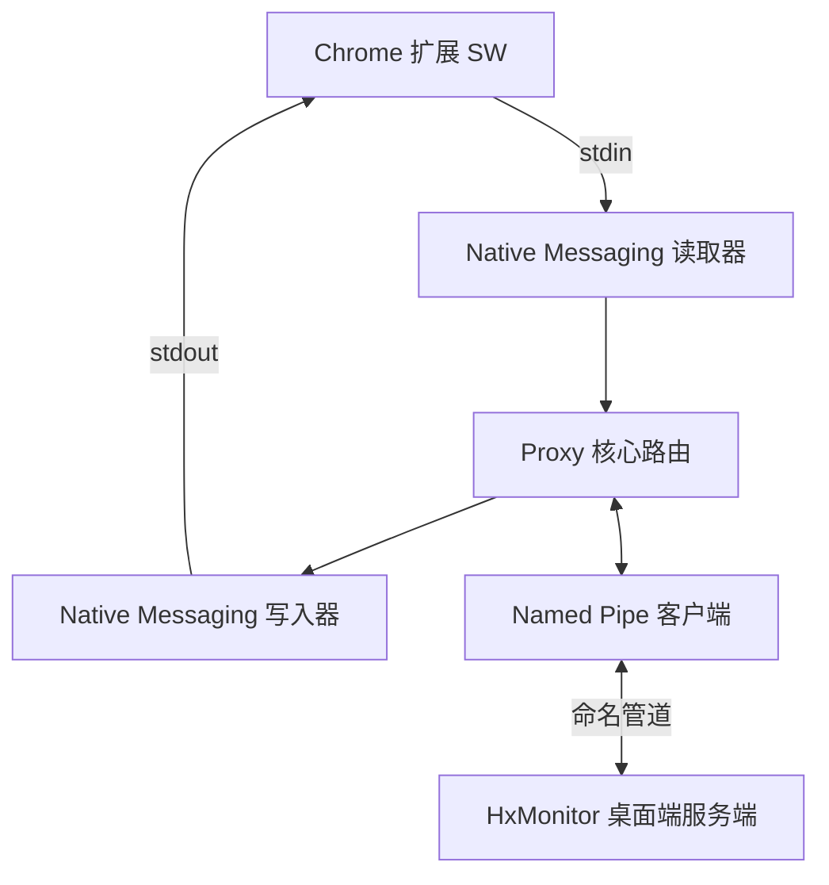

# E2C Proxy 程序架构与开发路线 (Architecture & Roadmap)

## 1. 程序架构设计

E2C Proxy 是一个极其轻量级的“无头 (Headless)”中转站，核心功能是在标准的 I/O 和系统级 IPC (Named Pipe) 之间透传数据。

### 核心模块职责：
1. **`nativemsg` 模块**：
   - 负责与浏览器的 `stdin` 和 `stdout` 进行交互。
   - 解析/封装 Chrome Native Messaging 特有的“4字节小端序长度前缀 + JSON”格式。
   - **关键防遗留**：一旦在 `stdin` 上遇到 EOF（即 Chrome 断开），立刻下发关闭信号，安全中止进程。

2. **`pipeclient` 模块**：
   - 作为 Windows 命名管道客户端，连接 `\\.\pipe\MediaControlHubPipe`。
   - 实现断线重连机制（间隔 3 秒）。
   - 提供发送和接收 JSON 字节流的接口。

3. **`proxy` 路由模块**：
   - 将 `nativemsg` 中读取到的数据放入发送队列或直接丢弃（根据连接状态）。
   - 如果在线，将数据透传进 `pipeclient`。
   - 将 `pipeclient` 接收到的数据透传进 `nativemsg` 的写入器。

## 2. 开发路线 (Roadmap)

- [x] **第一阶段：环境基建与 Native Messaging 基础层**
  - 初始化 Go 模块。
  - 实现读写 `stdin/stdout` 并正确处理 4 字节的头。
  - 编写本地化单元测试，模拟输入验证头部解析算法的准确性。
  - 验证 EOF 退出机制。

- [x] **第二阶段：IPC 命名管道客户端开发**
  - 使用 Go 的 Windows 系统库实现对 Named Pipe 的连接。
  - 加入断线重试机制，并通过日志或内部状态反映连通性。

- [x] **第三阶段：业务粘合与消息队列处理**
  - 整合 `nativemsg` 和 `pipeclient`。
  - 采用无阻塞丢弃策略（当系统不在线时直接忽略浏览器输入）。
  - 确保并发读取与写入的安全性。

- [x] **第四阶段：集成测试与编译发布**
  - 关闭所有本地调试日志输出（直接废弃）。
  - 使用 `go build -ldflags="-H windowsgui -s -w"` 编译了彻底无黑窗口的单文件 `e2c_proxy.exe`。
  - 编写专用的 `test_runner.go` 与 `test_mock_server.go` 并全部测试通过。

## 3. 架构与开发变更总结 (Changelog)

在实际开发和对接过程中，除了完成了既定构想以外，我们还针对 **Microsoft Edge** 环境作出了定制增强，具体变更汇总如下：

1. **零依赖的轻量化处理**：由于不牵涉业务逻辑，Proxy只作为管道“直肠子”，在遇到 Chrome/Edge `EOF` 断开连接时，直接以 `os.Exit(0)` 退出，杜绝了任何驻留僵尸进程的可能性，实现了轻量化目标。
2. **专属 Edge 支持配置**：
   - 创建了 `manifest.json` ，并确认在 Edge 下合法的跨域协议声明必须为 `chrome-extension://<EXTENSION_ID>/`。
   - 编写了 `install_edge.bat` 和 `uninstall_edge.bat` 两个自动化安装脚本，用于将代理入口注册入针对 Edge 专属的注册表键值区间 `HKCU\Software\Microsoft\Edge\NativeMessagingHosts` 中。
3. **编写配套使用指南**：在 `doc` 中新增了 `integration_guide.md` ，详细规范了 Extension 端和 HxMonitor 服务端代码层面的接入范例。
4. **测试验证自动化**：开发并预留了 `test_runner.go` （双向全流程模拟），无需启动 Edge 即可验证管道转发正常运作。
