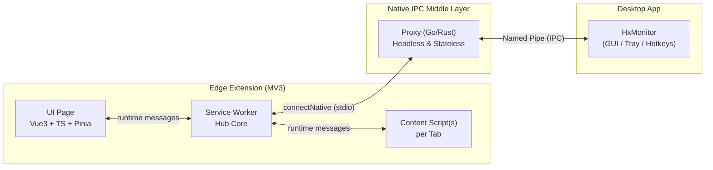
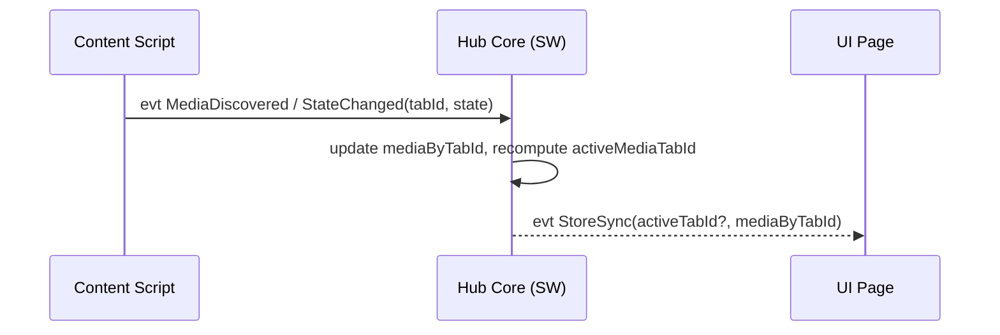
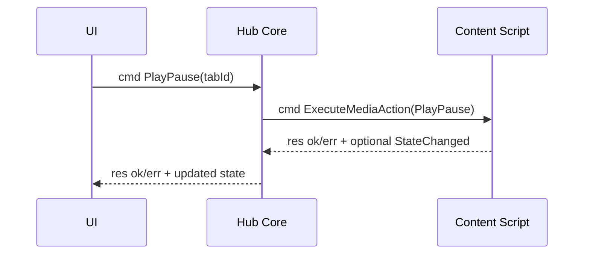
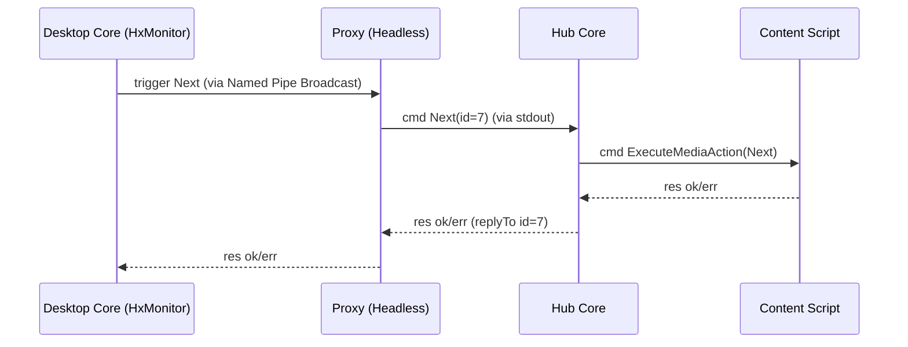

# 1. 范围与关键约束

- Edge 扩展作为 HUB 主控：统一管理浏览器内所有可能播放媒体的 Tab，并将控制命令路由到正确 Tab。
- 扩展与桌面程序双向通信采用 Native Messaging（stdio JSON framing）。
- 不引入插件机制（无插件市场、无动态插件加载）。
- 不引入鉴权/权限/沙箱等安全工程化。

# 2. 组件视图（三层解耦架构）



说明：

- **Hub Core 放在 Service Worker**：负责全局状态、命令路由、与桌面 Proxy 会话管理。
- **Content Script 是“媒体执行器”**：在网页上下文中探测/控制媒体，并将状态上报给 Hub Core。
- **Proxy（中间代理层）**：轻量级无头进程。由浏览器按需自动拉起并管控生命周期，仅作为 `stdin/stdout` 和系统 Named Pipe（进程间通信）的传声筒。解决多浏览器配置拉起多实体冲突问题。
- **UI Page 是“操作与观测面板”**：以卡片列表展示所有媒体 Tab，并对每张卡直接下发命令。


# 3. 核心数据流

## 3.1 扩展侧媒体状态采集



状态采集策略：

- 每个 Tab 独立上报 `hasMedia/playing/metadata/lastActiveAt`。
- Hub Core 维护 `mediaByTabId` 映射与 `activeMediaTabId`。

## 3.2 用户点击“播放/暂停”



## 3.3 桌面程序触发“下一首”



# 4. Hub Core 的状态模型（已实现）

实际状态结构（`sw/hub/store.ts`）：

```typescript
{
  connection: { connected: boolean, lastError?: string },
  media: {
    activeTabId: number | null,
    byTabId: Record<number, MediaState>
  },
  ui: {
    pinnedTabId: number | null,
    lastFocusedTabId?: number   // 用于 activeTabId 计算
  }
}
```

`MediaState` 实际字段：

| 字段 | 类型 | 来源 |
|---|---|---|
| `hasMedia` | boolean | 页面是否有媒体元素 |
| `playing` | boolean | 是否正在播放 |
| `title` | string? | MediaSession / 页面 title / tab title |
| `artist` | string? | MediaSession artist / tab URL hostname |
| `artwork` | string? | MediaSession artwork / og:image / video.poster / favicon |
| `durationMs` | number? | `el.duration * 1000` |
| `positionMs` | number? | `el.currentTime * 1000` |
| `lastActiveAt` | number | 最后活跃时间戳 |
| `windowId` | number? | 所在浏览器窗口 ID（由 SW 注入） |

# 5. activeMediaTabId 选择策略（已实现）

实际优先级（`store.ts recomputeActiveTab`）：

1. `lastFocusedTabId` 有媒体 → 用户正在看的 tab 优先
2. `playing=true` 的 tab（最近活跃优先）
3. 最近 `lastActiveAt` 最大的 tab
4. 否则为 `null`

失败回退：

- 命令下发失败时，自动从 `byTabId` 移除该 tab（`removeTab`）。
- SW 重启后状态清空，收到 `GetMediaList` 时广播 `queryState` 给所有 tab 恢复状态。
